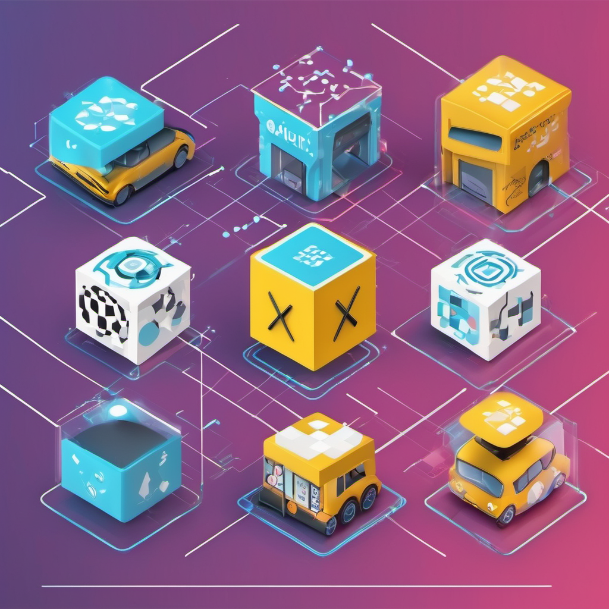

# IBM_DETBeans

An Artificial Intelligence project aimed to solve the challenge proposed
by IBM in Makeathon Athens.

## Authors

- Simos Anastasios Athanasiadis
- Aggelos Ioannis Lagos
- Dimitrios Papathanasiou

## Model Implementation
Our innovative approach combines AI with optimization models to target the 
resolution of the critical business challenge faced by Chicago Taxi in 
managing the optimal balance of taxi availability at the airport. 
By seamlessly integrating big data analytics and insights from flight 
schedules and delays, the developed models offer actionable insights, 
ensuring Chicago Taxi maintains an optimal and profitable fleet size at all 
times. Through sophisticated analysis of provided datasets, these models 
not only identify correlations between flight delays and taxi pickup times 
but also utilize AI-driven optimization techniques. This unique combination 
enhances revenue generation and boosts customer satisfaction levels for the 
company.

## Contents
In the current implementation, various analytics, optimization and machine learning techniques are
combined to create an innovative and complex approach.

- Machine Learning model that predicts flight delays for proactive taxi deployment.
- Method which calculates hourly taxi demand for efficient resource allocation.
- Optimization model that dynamically adjusts fleet size for optimal operations.

